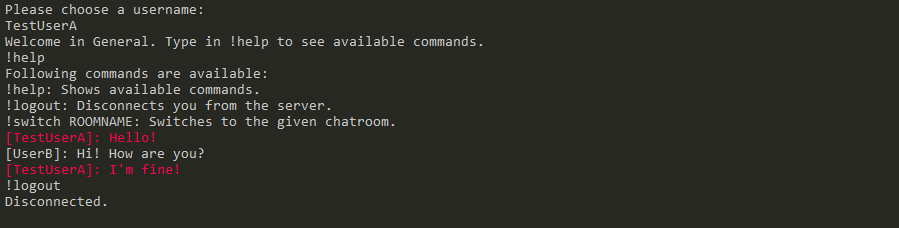

# Simple CLI Chat Application Written in C!

This CLI chat application got developed as part of the programming course 1 at the DHBW Stuttgart and is based on the MQTT protocol.  

## Build
Build CMakeLists.txt as CMake project.
The .exe file is then located in *out/build/x64-Debug/chatroom.exe* and can be executed from there.
Required .h, .lib and .dll files get added to the right folders and get linked accordingly.

## Features
The CLI application allows users to chat with multiple other users in various chatrooms.
After selecting a username at start-up, the user connects to the default chatroom and they can start chatting.
Own messages are colored in red while doing so.

Some simple commands are also available for users. Commands are generally initiated with a starting `!`:
| Command           | Description                   |
| ----------------- | ----------------------------- |
| !help             | Shows all available commands. |
| !logout           | Logs out the user.            |
| !switch ROOMNAME* | Changes the chatroom.         |

**Chatroom names aren't predefined and can freely be chosen*

The application currently connects to a public server to allow connecting at any time hence please do not use it for sensitive information! 

## Implementation
Project is build using CMake.

The CLI application is fully written in C and uses the [Eclipse Paho C Client Library for the MQTT Protocol](https://github.com/eclipse/paho.mqtt.c).
The libraries enable applications to connect to an MQTT broker to publish messages, subscribe to topics and receive published messages.

Chatrooms of this application are based on MQTT topics. 
MQTT Topics allow multiple clients to communicate with each other, if they are subscribed to the same topic and can consist of one or more topic levels.

In this context all chatrooms can freely be chosen and are at topic level 1 while being unified with an unique topic identifer at topic level 0.
Users can join only one chatroom at a time with the help of `!switch ROOMNAME` instead of multiple ones to ease the usabilty in regard to the project scope.
In terms of MQTT, clients unsubscribe their current chatroom and then subscribe to the new one when they try to switch a room.

The client currently connects to a public broker hosted by [HiveMQ](http://www.mqtt-dashboard.com/).